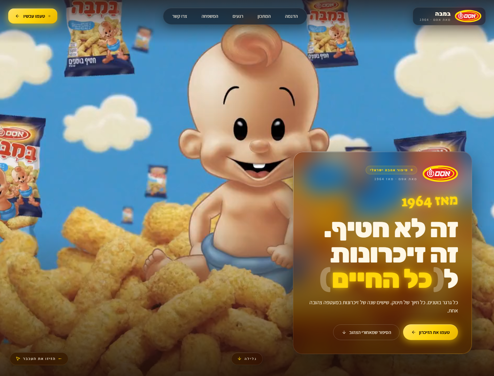
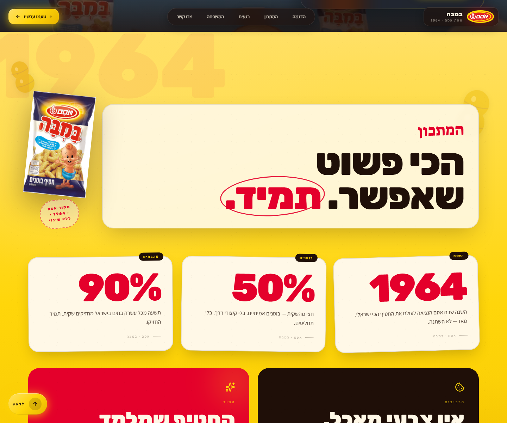
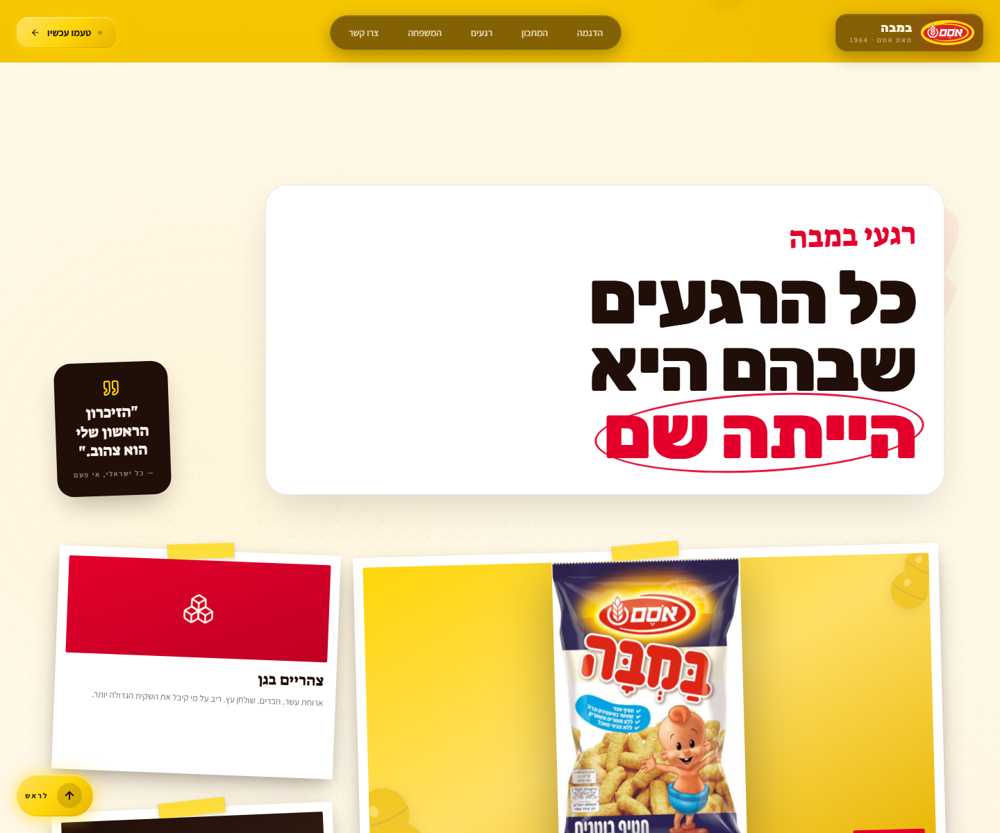
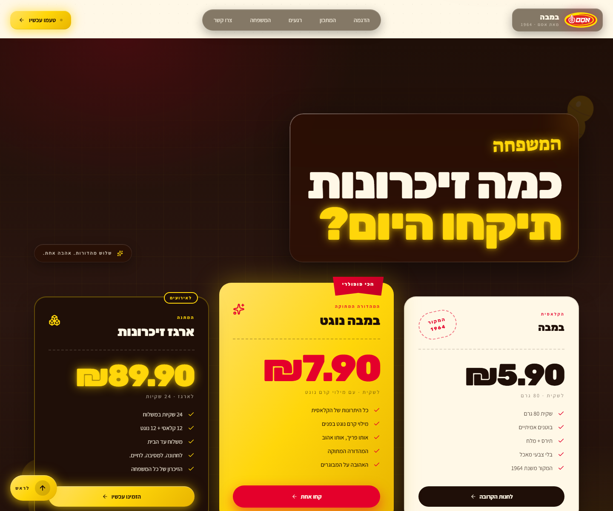
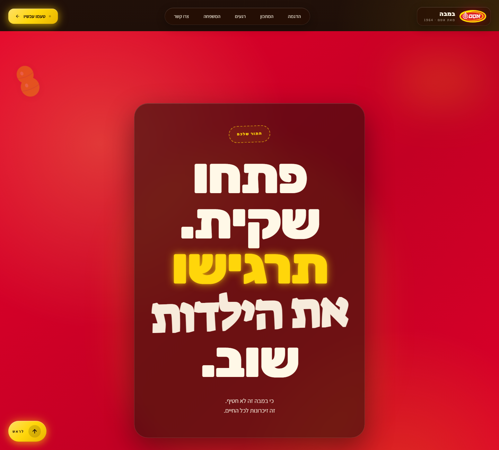

# Cinematic Scrub Landing Page — The Golden Template

Build a premium, brand-aware landing page where the hero video responds to the mouse and the rest of the page walks the viewer through a 5-beat narrative arc. The user provides a video, optionally a logo + product photo + brand context — this skill handles palette extraction, typography selection, RTL/LTR, scaffolding, the all-keyframes video re-encode, the mouse-scrub effect, the section library, and verification.

## Why this skill exists

The reference implementation lives in <https://github.com/hoodini/bamba> — an Israeli RTL site for the snack "במבה" where a baby video tracks the cursor across the whole page while 4 distinct sections below (bright yellow recipe, cream nostalgia album, dark contemplative pricing, red action finale) walk the viewer through *longing → joy → nostalgia → contemplation → action*.



Every rule in this skill was extracted from that build. The bullets in [the hard-rules section](#phase-8--hard-rules-priority-over-any-contradicting-best-practice) are ALL hard-won — they override generic "good code" defaults.

---

## Section gallery (what you're building)

The hero stays on top. Below it, pick 4 sections from the library, ordered to follow the narrative arc. Each is fully opaque (no video bleed-through) and has its own brand identity:

| Beat | Type | Reference |
|---|---|---|
| 1 — Longing | **Hero** (mouse-scrub video) |  |
| 2 — Joy | **Sun** — bright primary-accent gradient, floating motif SVGs, giant ghost typography, stat cards |  |
| 3 — Nostalgia | **Album** — cream paper, dotted micro-pattern, polaroid bento with real product photo |  |
| 4 — Contemplation | **Roast** — dark with radial accent glows, three pricing cards each with DIFFERENT visual treatment |  |
| 5 — Action | **Signal** — full-bleed strong accent (red/orange/green), massive headline + CTA, glass-contained panel |  |

For technical/SaaS brands, swap section types as needed (see the section library below) — but always end with a Signal section.

---

## How to use this skill

1. **Drop assets** into a clean working directory:
   - Hero video (any container — `.mp4`, `.mov`, `.webm`)
   - Logo (SVG strongly preferred; PNG with transparency acceptable)
   - 1-3 product/subject images (JPG/PNG, transparent ideal)

2. **Confirm with the user (briefly — propose defaults, move on):**
   - Product name + meta-tagline
   - Language code (drives RTL/LTR + font choice)
   - Brand context — era, audience, emotional core, palette feel
   - Optional: explicit palette hexes, narrative arc beats

3. **Execute the workflow below in order.** All phases are mandatory. Don't skip the ffmpeg re-encode — that's the magic that makes scrub feel buttery.

4. **Verify before reporting done.** Phase 9 has 12 checks. Run all of them.

---

## INPUTS — collect these from the user

```yaml
PRODUCT_NAME: "<e.g. במבה / Bamba / Hope the Cheetah / Acme CRM>"
TAGLINE: "<the meta-message — e.g. 'it's not a snack, it's lifelong memories'>"
LANGUAGE: "<he | en | ar | es | fr | ja | ...>"
IS_RTL: "<true | false>"                                   # he/ar/fa = true; everything else = false
HERO_VIDEO_FILE: "<exact filename in cwd — e.g. baby2.mp4>"
LOGO_FILE: "<exact filename — leave blank if none>"
PRODUCT_IMAGE_FILE: "<exact filename — leave blank if none>"
BRAND_CONTEXT: |
  <2-4 sentences: era it evokes, who the audience is, the emotional core,
  the visual identity (warm/cool/playful/serious). Drives palette + motifs.>
PALETTE: "<optional — comma-separated hexes if overriding>"
NARRATIVE_ARC: "<optional — 5 emotional beats; AI proposes if blank>"
```

The full text-template (with the same YAML block and prompt body) is in [`references/GOLDEN_PROMPT.md`](references/GOLDEN_PROMPT.md) — paste it into Claude with the YAML filled in when you don't have direct skill-runtime access.

---

## Phase 0 — Plan the design (output a ≤200-word brief before coding)

Before writing any code, output:

1. **Extracted 5-color palette**: `background` (deepest ink), `cream` (warm off-white text — NEVER `#FFFFFF`), `accent` (primary brand color), `accent2` (secondary brand color), `support` (tertiary tone). Extract from the logo + product image if no `PALETTE` was given. **The palette must be internally cohesive** — all warm OR all cool, never mixed. Warm brands (food, nature, nostalgia, animals) → no blues, teals, mints, cyans. Cool brands (tech, finance, medical, sci-fi) → no warm tones except a tiny accent.

2. **Typography trinity** (display / body / handwritten-accent) for the language:
   - `he`: Rubik (display) + Assistant (body) + Suez One (accent)
   - `en`: Anton (display) + Inter (body) + Caveat (accent)
   - `ar`: Cairo (display) + Tajawal (body) + Reem Kufi (accent)
   - `es` / `fr` / `it` / `de`: Anton or Bebas Neue (display) + Inter (body) + Caveat (accent)
   - `ja`: Noto Sans JP weight 900 (display) + Noto Sans JP (body) + Yusei Magic (accent)
   - Other: pick three Google Fonts matching the script, with the same `display-black / body-clean / handwritten-script` roles.

3. **Narrative arc** — 5 emotional beats that map to `BRAND_CONTEXT`. Match each to a section type from the [section library](#phase-7--section-library-pick-4-5-after-the-hero).

Then execute — do not ask for confirmation.

---

## Phase 1 — Asset preparation (the magic step)

### 1a. Verify ffmpeg

```bash
which ffmpeg     # or: Get-Command ffmpeg on PowerShell
```

If absent, stop and tell the user to install (`brew install ffmpeg` / Windows: <http://ffmpeg.org>).

### 1b. Re-encode the hero video with every frame as a keyframe

Browsers can only seek instantly to keyframes — standard video has ~1 keyframe per 250 frames, which makes mouse-scrub stutter horribly. This single command is the difference between premium and amateur:

```bash
ffmpeg -y -i <HERO_VIDEO_FILE> -g 1 -keyint_min 1 -c:v libx264 -preset slow -crf 20 -pix_fmt yuv420p -an hero.mp4
```

Verify the output: `hero.mp4` should be 5-50 MB. If > 50 MB re-run with `-crf 25`; if > 80 MB with `-crf 28`. Strip audio (`-an`) — the hero is silent.

### 1c. Copy logo + product image

```bash
cp <LOGO_FILE>           public/logo.<ext>
cp <PRODUCT_IMAGE_FILE>  public/product.<ext>   # if provided
```

---

## Phase 2 — Scaffold

```bash
npm create vite@latest site -- --template react-ts
cd site
npm install
npm install lucide-react
npm install -D tailwindcss@3 postcss autoprefixer
npx tailwindcss init -p
mkdir -p public
mv ../hero.mp4 public/hero.mp4
# Also move the logo + product image into public/
```

---

## Phase 3 — Tailwind config

Replace `tailwind.config.js` entirely. Use the extracted palette and the language-appropriate fonts:

```js
/** @type {import('tailwindcss').Config} */
export default {
  content: ["./index.html", "./src/**/*.{js,ts,jsx,tsx}"],
  theme: {
    extend: {
      colors: {
        background: '<ink/dark>',
        cream:      '<warm off-white — NEVER #FFFFFF>',
        accent:     '<primary brand color>',
        accent2:    '<secondary>',
        support:    '<tertiary>',
      },
      fontFamily: {
        sans:    ['<body font>',         'system-ui', 'sans-serif'],
        display: ['<display font>',      'sans-serif'],
        accent:  ['"<handwritten font>"', 'cursive'],
      },
    },
  },
  plugins: [],
}
```

---

## Phase 4 — index.html

Replace entirely. Honor `IS_RTL`. Always include the favicon link pointing at the logo:

```html
<!DOCTYPE html>
<html lang="<LANGUAGE>" dir="<rtl|ltr>">
  <head>
    <meta charset="UTF-8" />
    <link rel="icon" type="image/svg+xml" href="/logo.svg" />
    <link rel="apple-touch-icon" href="/logo.svg" />
    <meta name="viewport" content="width=device-width, initial-scale=1.0" />
    <link rel="preconnect" href="https://fonts.googleapis.com">
    <link rel="preconnect" href="https://fonts.gstatic.com" crossorigin>
    <link href="<Google Fonts URL for the three chosen fonts>" rel="stylesheet">
    <title><PRODUCT_NAME> — <TAGLINE></title>
  </head>
  <body>
    <div id="root"></div>
    <script type="module" src="/src/main.tsx"></script>
  </body>
</html>
```

---

## Phase 5 — index.css (the design system)

Replace entirely. Every utility below is load-bearing. Names assume the warm palette extracted earlier; for a cool brand swap "yellow"/"red" mentions in shadow tints for the actual accent colors.

Must include:

- `html { scroll-behavior: smooth; }` + `section[id] { scroll-margin-top: 90px; }` so anchored sections don't land under the fixed nav.
- `body` background = `background` color (fallback if video fails). Cursor = `crosshair`. Default font = body sans.
- `.liquid-glass` / `.liquid-glass-strong` — backdrop-blur + saturate + inset-light border + masked gradient edge highlight. Strong variant uses an inset glow tinted with `accent`.
- `.glass-pill` — compact rounded pill with the same glass treatment for nav items and small badges.
- `.cta-primary` — brand CTA: `linear-gradient(135deg, accent-light, accent, accent-shade)` + accent-color glow shadow that intensifies on hover + `translateY(-1px)` lift.
- `.brand-mark` — small square/circle for tiny logo marks if no SVG is provided.
- `.grid-bg` — subtle 1px grid with radial fade-mask, used under dark sections.
- `.reveal` / `.revealed` — IntersectionObserver scroll-reveal: `opacity 0 → 1` + `translateY 28 → 0` over 0.9s with `cubic-bezier(0.16, 1, 0.3, 1)`.
- `.scrim-top` / `.scrim-bottom` — gradient overlays for the hero only.
- **Per-section backgrounds**, named by feeling not color:
  - `.sun-section` — bright primary-accent gradient + subtle dotted texture (the "joy / opening the bag" beat).
  - `.album-section` — warm off-white paper, radial accent tints + dotted micro-pattern, edge-mask fade.
  - `.roast-section` — dark with radial accent + accent2 glows in opposite corners + masked grid texture.
  - `.signal-section` — full-bleed strong accent (often red/orange/green) for the action finale.
- `.polaroid` — white card, padding `14px 14px 44px 14px`, soft layered shadow, hover lift to `translateY(-6px) rotate(0)`. `.polaroid-tape` = yellow/accent tape strip absolutely positioned at top-center, rotated -4°, with dashed side hints.
- `.stamp` — dashed-border pill in accent color, uppercase, letter-spacing `0.18em`.
- `.ribbon` — pricing/popular badge with `clip-path` triangle bottom, dark drop shadow.
- `.highlight-circle` — hand-drawn-feel oval drawn via `::after`: rotated 3px accent-color border around an inline `<span>`. Use it around the single most important word in big headings (one per heading max).
- Decorative motif filter: `.peanut-svg` / `.<motif>-svg` with `drop-shadow`.
- Honor `prefers-reduced-motion: reduce` — disable reveal animation + smooth scroll inside the media query.

---

## Phase 6 — App.tsx architecture

Architecture is non-negotiable. Get it right the first time:

### 6a. Imports

```tsx
import { useEffect, useRef, useState } from 'react';
import {
  Menu, X, ArrowLeft, ArrowRight, ArrowDown, ArrowUp, MousePointer2,
  // …plus 4-8 brand-thematic icons (Heart, Sparkles, Cookie, PawPrint, Cpu, Leaf, …)
} from 'lucide-react';
```

### 6b. Reusable components defined inside App.tsx

- `useReveal<T>()` — IntersectionObserver hook returning a ref; adds `revealed` class on first intersect (threshold 0.15).
- `GlassCard` — wrapper with the reveal hook, optional `strong` prop, accepts className.
- `Motif` — a single decorative SVG component themed to `BRAND_CONTEXT` (peanut for food, paw for animals, circuit for tech, leaf for nature, droplet for beverage, bolt for energy). Floats at low opacity in 3-6 places per dark/bright section.
- `ScrollToTopButton` — fixed `bottom-6 left-6` in RTL / `bottom-6 right-6` in LTR. Appears when `window.scrollY > window.innerHeight * 0.6`. Smooth scrolls to top. Short language-appropriate label ("לראש" / "Top" / "أعلى" / "Inicio").

### 6c. Mouse-scrub effect (the heart)

```tsx
const videoRef = useRef<HTMLVideoElement>(null);
const stateRef = useRef({ targetTime: 0, isSeeking: false });

useEffect(() => {
  const video = videoRef.current;
  if (!video) return;

  const handleLoaded = () => {
    const mid = video.duration / 2;
    video.currentTime = mid;
    stateRef.current.targetTime = mid;
  };

  const handleSeeked = () => {
    const s = stateRef.current;
    s.isSeeking = false;
    if (Math.abs(s.targetTime - video.currentTime) > 0.01) {
      s.isSeeking = true;
      video.currentTime = s.targetTime;
    }
  };

  const handleMouseMove = (e: MouseEvent) => {
    const s = stateRef.current;
    const d = video.duration;
    if (!d || isNaN(d)) return;
    const normalized = e.clientX / window.innerWidth;
    // If subject moves "backwards" relative to cursor and feels wrong, optionally
    // use `1 - (e.clientX / window.innerWidth)` instead — ASK the user first.
    s.targetTime = Math.max(0, Math.min(d, normalized * d));
    if (!s.isSeeking) { s.isSeeking = true; video.currentTime = s.targetTime; }
  };

  video.addEventListener('loadedmetadata', handleLoaded);
  video.addEventListener('seeked', handleSeeked);
  window.addEventListener('mousemove', handleMouseMove);
  return () => {
    video.removeEventListener('loadedmetadata', handleLoaded);
    video.removeEventListener('seeked', handleSeeked);
    window.removeEventListener('mousemove', handleMouseMove);
  };
}, []);
```

The `isSeeking` guard is **critical** — without it, mousemove fires faster than the browser can decode and you get seek-queue overflow + visible stutter.

### 6d. Clickable scroll-spy navigation

```tsx
const navItems: { label: string; target: string }[] = [
  { label: '<demo>',     target: 'top'     },
  { label: '<recipe>',   target: 'recipe'  },
  { label: '<moments>',  target: 'moments' },
  { label: '<family>',   target: 'family'  },
  { label: '<contact>',  target: 'contact' },
];

const scrollToSection = (target: string) => {
  setMenuOpen(false);
  if (target === 'top') { window.scrollTo({ top: 0, behavior: 'smooth' }); return; }
  document.getElementById(target)?.scrollIntoView({ behavior: 'smooth', block: 'start' });
};
```

Wire `onClick={() => scrollToSection(target)}` on every nav item. The CTA button in the nav also calls `scrollToSection('contact')` (or whatever the final beat's id is).

### 6e. Root JSX layout — THE Z-INDEX TRAP (do not violate)

```tsx
return (
  <div className="relative">                              {/* NO bg-* class on this wrapper */}
    <ScrollToTopButton />
    <video ref={videoRef} src="/hero.mp4" muted playsInline preload="auto"
           className="fixed inset-0 h-full w-full object-cover -z-20" />

    <nav className="fixed top-0 inset-x-0 z-50 ...">{/* nav */}</nav>
    {menuOpen && <div className="fixed top-24 inset-x-4 z-40 ...">{/* mobile menu */}</div>}

    <section className="relative h-screen overflow-hidden">{/* HERO — video shows through */}</section>
    <section id="recipe"   className="sun-section ...">{/* OPAQUE — own identity */}</section>
    <section id="moments"  className="album-section ...">{/* OPAQUE */}</section>
    <section id="family"   className="roast-section ...">{/* OPAQUE */}</section>
    <section id="contact"  className="signal-section ...">{/* OPAQUE — the action finale */}</section>
    <footer  className="bg-background py-8 ...">{/* mini-footer */}</footer>
  </div>
);
```

**The outer `<div>` MUST NOT have a background color.** Any `bg-background` / `bg-cream` / `bg-white` on the wrapper paints over the `-z-20` video and the hero scrub stops working. Only `body` has `bg-background` as a fallback. This was the #1 mistake in the reference build. Catch it before you ship.

---

## Phase 7 — Section library (pick 4-5 after the hero)

The hero is section 1. Then pick 4 more from this library, ordered to follow `NARRATIVE_ARC`. **Do not repeat the same pattern twice.** Each section is fully opaque with its own background — the video bleeds through the hero only.

### Type A — "Sun" (bright primary accent)


Big primary-color gradient background. Floating motif SVGs at low opacity. Giant faded ghost number/word in a corner (e.g. founding year at 6% opacity, 260px). Headline panel: contrasting cream-tinted rounded card with strong shadow — heading inside, accent script word at -2° rotation as eyebrow, big display-black headline ending in a `.highlight-circle` word. **Real product photo** floats tilted next to the heading (6°, drop-shadow), hover-untwists. Three stat cards below in a row, each cream-rounded-[28px] with different slight rotations (-1.5°, 0.8°, -0.6°), each containing a massive display-black accent2 numeral (88-110px), a small label badge top-right, body text, footer attribution. Two large contrasting text panels at the bottom (one dark, one accent2-color) with thematic icons.

### Type B — "Album" (cream nostalgia paper)


Cream paper background with subtle dotted micro-pattern (masked at edges). Giant faded handwritten word in `accent2` at 4-6% opacity in a corner. Headline panel: pure-white rounded card with shadow. Beside it, a quote card: dark background, accent-colored quote icon, font-accent (handwritten) testimonial, attribution underline, slight -2° rotation. Body: **polaroid bento grid** — one large featured polaroid (`md:col-span-2 md:row-span-2`, -1.5° rotation) containing the `PRODUCT_IMAGE` inside a gradient frame with motif corner-tucks and a tag badge, plus 4 smaller polaroids each with a thematic icon-on-gradient image area, all with yellow/accent tape, all with handwritten captions, slightly different rotations.

### Type C — "Roast" (dark contemplation)


Dark background with radial accent + accent2 glows in opposite corners, plus the masked grid texture. Floating motif SVGs at very low opacity. Headline panel: `liquid-glass-strong` rounded panel with accent-glow heading. Side label: `glass-pill` with thematic icon + one-line phrase. Body: **three pricing cards with three DIFFERENT visual treatments** (this variety is essential — never three identical cards):
1. **Light card** — cream paper with accent border, peanut-brown dark text, dashed-stamp badge top-right, classic price numeral, dark CTA button.
2. **Highlighted card** — accent-color gradient background, slightly larger (negative margin top to lift), `.ribbon` at top-right, accent2 huge price numeral, accent2 CTA with intense glow.
3. **Dark card** — dark with accent2 trim, accent2 numeral with glow, motif icon, `cta-primary` button.

### Type D — "Signal" (the final action)


Full-bleed strong accent color (red, orange, green — whatever the brand's "go" color is) with two large blurred orbs of accent2 in opposite corners and a giant centered accent2 oval blur behind the text. Floating motif SVGs at ~30% opacity. A single contained panel (dark-translucent backdrop-blur with accent tint) holding: `.stamp` badge eyebrow at -2°, MASSIVE responsive headline (60→148px) mixing display-black and a handwritten line in the middle, ending with a short final word. Subtitle below in 2 lines. Big primary CTA button (cream background, accent text) with a tiny pulsing dot indicator. Optional secondary outlined link. Logo flanked by horizontal dividers ("by <BRAND>") at the bottom.

### Type E — "Workshop" / "Specs" (technical)

For tech / SaaS / B2B where one of the beats is "how it works". Dark background, alternating left/right two-column rows: a numbered eyebrow + heading + body on one side, a glass card with code/diagram/screenshot on the other. Strong vertical rhythm. Use in place of B or C when `BRAND_CONTEXT` is technical.

**Always end with Type D (Signal) so the final beat is action.** Even technical SaaS pages need this — replace the warm finale with a cool one (deep blue or violet) but keep the structure.

---

## Phase 8 — Hard rules (priority over any contradicting "best practice")

1. **No background color on the outer wrapper `<div>`.** Only `body` gets `bg-background`. Anything else hides the video.
2. **Hero video is `position: fixed; -z-index: 20`** — re-encoded with `-g 1 -keyint_min 1`.
3. **Each non-hero section is fully opaque** with its own background class. Never use a partial scrim to "let the hero peek through" all sections — that's monotony pretending to be art.
4. **Each section has its own visual identity.** Different background, different palette emphasis, different layout pattern. Five sections must not look like five variations of one card grid.
5. **The narrative arc drives section order.** Start with the emotion `BRAND_CONTEXT` establishes; end with action.
6. **Headlines stay readable on busy backgrounds.** Every floating text block (heading, quote, subtitle, cursor cue, badge) is wrapped in a panel — `liquid-glass-strong` over dark sections, white/cream card over light sections, `glass-pill` for small cues. No text floats naked over busy textures.
7. **Headline max sizes**: hero ≤ 78px desktop (so the product/subject stays visible). Section headings ≤ 108px. Final CTA ≤ 148px (nothing else competes).
8. **Palette cohesion**: warm brand → no cool tones except tiny accents; cool brand → no warm tones except tiny accents. **Never use `#FFFFFF` for text** — always use the project's `cream` value.
9. **Logo treatment**: use the logo file as-is. Don't invert, don't tint, don't crop, don't wrap in a competing colored box. Sizing: nav `h-9` / hero attribution `h-12` / final-CTA attribution `h-16` / mini-footer `h-6`.
10. **Real product photography wins over generated gradients.** If `PRODUCT_IMAGE_FILE` was provided, use it prominently — featured polaroid AND hero side accent AND/OR one pricing card.
11. **Navbar is clickable and scroll-spy-able.** `{ label, target }` items, smooth-scroll to sections. `scroll-margin-top: 90px` on `section[id]` so they don't land under the nav.
12. **Scroll-to-top button** appears after 60% viewport scroll, fixed bottom-left in RTL / bottom-right in LTR, with a short language-appropriate label.
13. **RTL layout**: hero text panel bottom-RIGHT. Forward arrows = `ArrowLeft`. Cursor cue at bottom-LEFT. Mobile menu items right-aligned.
14. **LTR layout**: hero text panel bottom-LEFT. Forward arrows = `ArrowRight`. Cursor cue at bottom-RIGHT.
15. **Favicon is the logo**, set in `index.html` via `<link rel="icon" type="image/svg+xml" href="/logo.svg" />`. Add `apple-touch-icon` too.
16. **Decorative motif SVGs** — design ONE in-file React component themed to `BRAND_CONTEXT` (peanut, paw, circuit, leaf, droplet, bolt, snowflake). Floats at low opacity in 3-6 instances per dark/bright section.
17. **Ghost typography**: at least one section gets a giant low-opacity (4-8%) word or number in a corner — the founding year, a one-word emotion, the brand name. 200-300px, faint enough to feel like a watermark.
18. **Handwritten accent**: use the script font for the section eyebrow ("המתכון" / "the recipe" / "el origen") at -2° rotation in accent color above each heading. Also use it for the middle line of the final CTA headline to break the rhythm.
19. **Stamp badges** instead of plain pill labels for "established X" / "since YYYY" / "original" / "limited" — dashed border, uppercase, letterspaced.
20. **Highlight-circle** the single most important word in each section headline — hand-drawn-feel red oval. One per heading max.
21. **Pricing cards must look different.** Light / highlighted-accent / dark — three distinct treatments. The highlight is bigger, has a ribbon, glows.
22. **Polaroid pattern** for nostalgic memory cards: white card, yellow/accent tape, slight rotation, handwritten caption, gradient image area, hover-un-rotates to 0° and lifts.
23. **CTAs use the brand CTA gradient + glow** (`cta-primary` class). Always with an arrow icon. Always with a tiny pulsing dot indicator if it's the primary primary action.
24. **Run `npx tsc --noEmit` after writing.** It must pass with zero output. Then `npm run dev` and verify the server starts cleanly. Don't claim done until both pass.
25. **Don't add features the user didn't ask for** — no contact form, no email signup, no analytics, no cookie banner, no language switcher, no dark mode toggle. Ship the spec.
26. **All copy is in `LANGUAGE`.** No mixing English boilerplate into a Hebrew page or vice versa. The only allowed non-`LANGUAGE` text is the brand mark itself, CSS font family names, and TypeScript/React identifiers.
27. **No emojis in code or copy** unless the brand voice explicitly demands them.
28. **No comments in code** unless explaining a non-obvious WHY (e.g. the isSeeking guard).

---

## Phase 9 — Run and verify

1. `npx tsc --noEmit` → zero output.
2. `npm run dev` → Vite reports `ready in <ms>` with no errors.
3. Open the local URL.
4. **Hero check** — page loads, hero is visible, moving the mouse scrubs the video smoothly with no stutter. If the subject moves "backwards" relative to cursor and feels wrong, ask the user before flipping to `1 - (e.clientX / window.innerWidth)`.
5. **Section identity check** — scrolling past the hero reveals 4 sections each with its OWN opaque background, none of which is the hero video bleeding through. If you can see the hero subject behind any later section, the outer wrapper has a `bg-` class — find and remove it (hard rule #1).
6. **Navbar click test** — click each nav item; smooth-scroll lands on the right section under (not covered by) the nav. CTA button in nav scrolls to the final action section.
7. **Scroll-to-top test** — scroll past 60% viewport; the floating button appears bottom-left (RTL) or bottom-right (LTR). Click → smooth scroll to top, button fades out.
8. **Logo check** — favicon visible in tab, logo at correct sizes in nav / hero / final / mini-footer, no inverts or tints.
9. **Asset check** — if a product image was provided, it appears at least once at significant size (featured polaroid or hero side accent), not just as a thumbnail.
10. **Responsive sanity** — at 360px, 768px, 1280px, no horizontal scroll, no text overlap, nav collapses to hamburger below `md`.
11. **Reduced motion** — set `prefers-reduced-motion: reduce` in devtools and reload. Scroll reveal should snap (no animation), smooth scroll should be instant.
12. If any check fails, **fix it before reporting done**. Do not leave it for the user.

Report the dev URL it printed, the palette + arc you chose, and the section types you used.

---

## Reference implementation

The Bamba (במבה) site at <https://github.com/hoodini/bamba> — RTL Hebrew landing for an Israeli snack with all five sections, the mouse-scrub baby backdrop, clickable navbar, and real Osem brand assets. When something in this skill is ambiguous, that repo is ground truth.

The full text template (same content as this SKILL.md formatted for paste-into-Claude use) is in [`references/GOLDEN_PROMPT.md`](references/GOLDEN_PROMPT.md). Use it as a fallback when the skill runtime isn't available.

---

## When to use other skills instead

- **`parallax-landing-page`** — scroll-driven, page itself locked, 5 text scenes crossfade as frames scrub. Use when the brief is "scroll scrubs the video and the page doesn't move".
- **`video-to-landing-page`** — Apple-style sticky-hero where scroll progresses the video frame through evenly-spaced JPEG extracts. Single hero with sections below.
- **`video-edit`** — captioning, transcript-based editing, social cuts. Not for landing pages.
- **`hyperframes`** — building HTML video compositions (the inverse direction — HTML → MP4).
- **This skill (`cinematic-scrub-landing`)** — mouse-driven scrub of a fixed full-page video backdrop, with a vertically-scrolling narrative arc of 4-5 opaque branded sections beneath. Pick this when the user wants the hero to **respond to the cursor** and the page below to **tell a story**.
